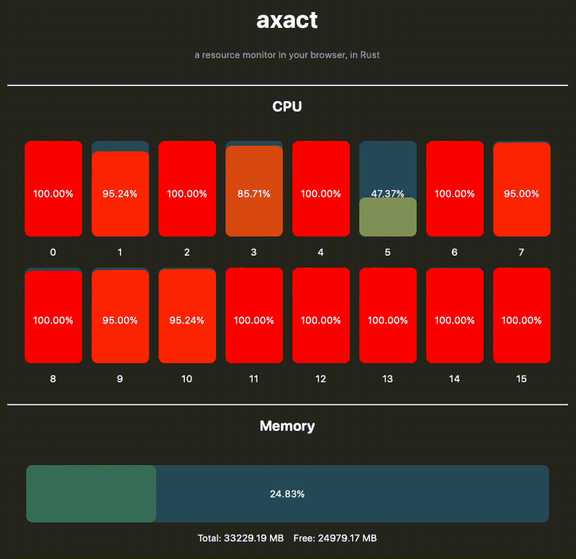

# axact

This is a fork of axact, a resource monitor in your browser.



## Installation

### Debian Package

The debian package can be built via `cargo deb`:

```bash
# Install cargo-deb
cargo install cargo-deb

# Build debian Package
cargo deb
```

and installed via apt or dpkg:

```bash
# apt
sudo apt install ./target/debian/axact_<version>_<arch>.deb

# or dpkg
sudo dpkg -i ./target/debian/axact_<version>_<arch>.deb
```

### Other Distros

If you are not using debian, there is still the possibility to use the `Makefile` in the root
of this repository:

```bash
make build
sudo make install
```

The Systemd service is not created with this method.


Enjoy the project!

## Original Project

A resource monitor in your browser, so you can view the state of a VM or
some other remote host. Built with Rust & Preact. See the video:
https://youtu.be/c_5Jy_AVDaM

## Community forks

  - Using yeap instead of preact and tower backend: <https://github.com/hanako-eo/axact>

  - Visualizing 128 cores: <https://github.com/useafterfree/axact>


  - Adding chat functionality: <https://github.com/shahzadnaeem/axact>


## License

This project is primarily distributed under the terms of both the MIT license
and the Apache License (Version 2.0).

See [LICENSE-APACHE](LICENSE-APACHE) and [LICENSE-MIT](LICENSE-MIT) for details.
